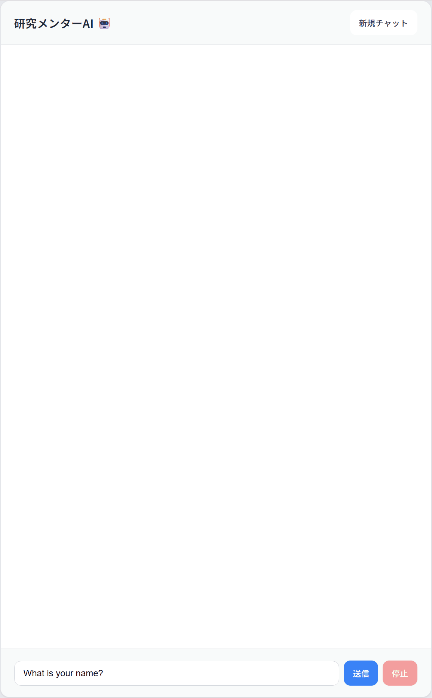

# Tian Chatbot

An AI-powered chatbot tool designed to help students preparing for Japanese graduate school entrance exams write research plans (研究計画書) more efficiently. The system provides real-time conversational guidance to organize ideas and refine research proposals. The app streams responses with Server-Sent Events (SSE) and uses Alibaba Cloud DashScope (Qwen) via LangChain4j.

## Demo

<p align="center">
  
</p>

## Stack

| Layer | Technology |
|-------|------------|
| Frontend | Vue 3, Vite, Marked, DOMPurify |
| Backend | Spring Boot 4, Java 21, LangChain4j |
| AI | DashScope (Qwen) |
| Packaging | Maven (backend), npm (frontend), Docker Compose |

## Repository layout

```
tian-chatbot/
├── tian-chatbot-backend/   # Spring Boot API
├── tian-chatbot-frontend/  # Vue 3 SPA
├── docker-compose.yml      # Run frontend + backend together
├── DEPLOY.md               # AWS EC2 deployment guide
├── .env.example            # Template for secrets (copy to `.env`)
└── README.md
```

This repo uses **Git submodules** for `tian-chatbot-backend` and `tian-chatbot-frontend`. Clone with:

```bash
git clone --recurse-submodules <repository-url>
```

## Quick start (local development)

**Prerequisites:** JDK 21 + Maven, Node.js 18+.

### Backend

Set your DashScope API key, then run:

```bash
export DASHSCOPE_API_KEY=your-key   # PowerShell: $env:DASHSCOPE_API_KEY="your-key"
cd tian-chatbot-backend
mvn spring-boot:run
```

API: `http://localhost:8080` — see [Backend README](tian-chatbot-backend/README.md) for details.

### Frontend

```bash
cd tian-chatbot-frontend
npm install
npm run dev
```

App: `http://localhost:5173` — Vite proxies `/api` to `localhost:8080`.

## Docker (recommended for EC2)

From the **repository root**:

```bash
cp .env.example .env
# Edit .env and set DASHSCOPE_API_KEY

docker compose up -d --build
```

Open `http://localhost` (port 80). Full EC2 steps: [DEPLOY.md](DEPLOY.md).

## Documentation

- [tian-chatbot-backend/README.md](tian-chatbot-backend/README.md) — API, configuration, build
- [tian-chatbot-frontend/README.md](tian-chatbot-frontend/README.md) — env vars, Vite proxy, scripts
- [DEPLOY.md](DEPLOY.md) — Docker Compose on AWS EC2

## License

This project is licensed under the MIT License - see the [LICENSE](LICENSE) file for details.
